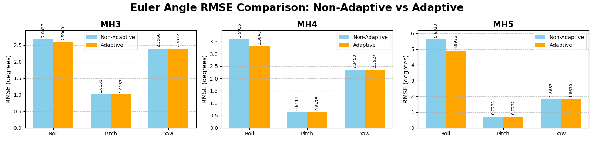

# Adaptive Visual-Inertial Odometry Using SuperGlue and Dynamic EKF with Information-Based Confidence Estimation

ATTENTION: COPYRIGHT NOTICE

The code and content in this repository belong to an unpublished academic article. All rights reserved. Any copying, distribution, reproduction, or use of this content in any form without explicit written permission is strictly prohibited. This material is for informational purposes only and should be kept confidential until the article is published.

Violations will be subject to legal action under copyright laws.

© 2024 Ufuk ASIL. All rights reserved.


# Flowchart of our algoritm


This project implements an Adaptive Visual-Inertial Odometry (VIO) system using SuperGlue for feature matching and a Dynamic Extended Kalman Filter (EKF) with Information-Based Confidence Estimation. The system is designed to provide robust and accurate pose estimation in challenging environments.

## Features

- Adaptive fusion of visual and inertial data
- SuperGlue-based feature matching for improved visual odometry
- Dynamic EKF with confidence-based weighting
- Support for various activation functions for confidence estimation
- Automatic dataset download and preprocessing
- Comprehensive visualization of results

## Installation

1. Clone this repository:
   ```
   git clone https://github.com/ufukasia/Adaptive-VIO-Odometry.git
   cd Adaptive-VIO-Odometry
   ```


2. Install PyTorch:

Highly recommended. It runs 20x faster with GPU.
   
For GPU (CUDA) support:
   ```
   pip3 install torch torchvision torchaudio --index-url --index-url https://download.pytorch.org/whl/cu118
   ```
   Note: Replace `cu118` with your CUDA version if different.   Please visit https://pytorch.org/get-started/locally/ for different installations

 

   For CPU-only:
   ```
   pip3 install torch torchvision torchaudio
   ```
   
3. Install the required dependencies:
   ```
   pip install -r requirements.txt
   ```


## Usage

The main script `main.py` can be run with various command-line arguments to customize the VIO processing:

```
python main.py [OPTIONS]
```

### Options:
***These parameters are set for best scores. It is likely that changing these values ​​will lower the result!***


- `--dataset_path`: Path to save the dataset (default: current directory)
- `--sequence`: Dataset sequence to use (default: MH_05_difficult)
- `--download`: Force download the dataset even if it exists
- `--alpha`: Alpha parameter for confidence estimation (default: 1.05)
- `--beta`: Beta parameter for confidence estimation (default: 1.05)
- `--gamma`: Gamma parameter for confidence estimation (default: 1)
- `--theta_threshold`: Theta threshold for adaptive fusion (default: 0.3)
- `--activation_function`: Activation function to use for confidence estimation (default: double_exponential_sigmoid)
- `--generate_superglue_visualizations`: Generate SuperGlue visualizations

### Example Usage:

1. Run with default settings:
   ```
   python main.py
   ```

2. Use a specific dataset sequence and download it:
   ```
   python main.py --sequence MH_03_medium
   python main.py --sequence MH_04_difficult
   python main.py --sequence MH_05_difficult

   ```

3. Customize confidence estimation parameters:
   ```
   python main.py --alpha 0.8 --beta 1.1 --gamma 2 --theta_threshold 0.25
   ```

4. Use a different activation function
   ```
   python main.py --activation_function relu --generate_superglue_visualizations
   ```

   5.Superglue visualizations
      ```
      python main.py --generate_superglue_visualizations
      ```

   


6. Process a locally stored dataset:
   ```
   python main.py --dataset_path /path/to/your/dataset --sequence custom_sequence
   ```

## Output

The script will generate the following outputs:

- Preprocessed IMU data
- Estimated pose values in CSV format
- Visualization plots for quaternions, Euler angles, and errors
- SuperGlue visualizations (if enabled)

# Test of our Algorithm
##Adaptive tests
python main.py --sequence MH_03_medium
python main.py --sequence MH_04_difficult
python main.py --sequence MH_05_difficult
##Nonadaptive tests
python main.py --sequence MH_03_medium --theta_threshold 1.1
python main.py --sequence MH_04_difficult --theta_threshold 1.1
python main.py --sequence MH_05_difficult --theta_threshold 1.1


***When you set the value of "theta_threshold" above "1", information-based confidence is disabled.***


Extensive testing of our developed algorithm across various hyperparameters of the Extended Kalman Filter (EKF) is ongoing. While the algorithm has not yet achieved optimal hyperparameters across all datasets at this stage, consistent improvement in results has been observed in each trial. These findings demonstrate the positive impact of our proposed method in the field of visual-inertial odometry (VIO). Furthermore, these results support the potential applicability of high-speed unmanned aerial vehicles (UAVs) in real-time dynamic scenarios.


## Contributing

Contributions to improve the system or add new features are welcome. Please feel free to submit pull requests or open issues for any bugs or suggestions.

## License

MIT Licence

## Citation

If you use this code in your research, please cite our paper:

```
[Ufuk ASIL](https://scholar.google.com/citations?user=TWYpF_MAAAAJ&hl=tr)
```

## Acknowledgements

This project uses the EuRoC MAV Dataset:

M. Burri, J. Nikolic, P. Gohl, T. Schneider, J. Rehder, S. Omari, M. Achtelik and R. Siegwart, The EuRoC micro aerial vehicle datasets, International Journal of Robotic Research, DOI: 10.1177/0278364915620033, 2016.
